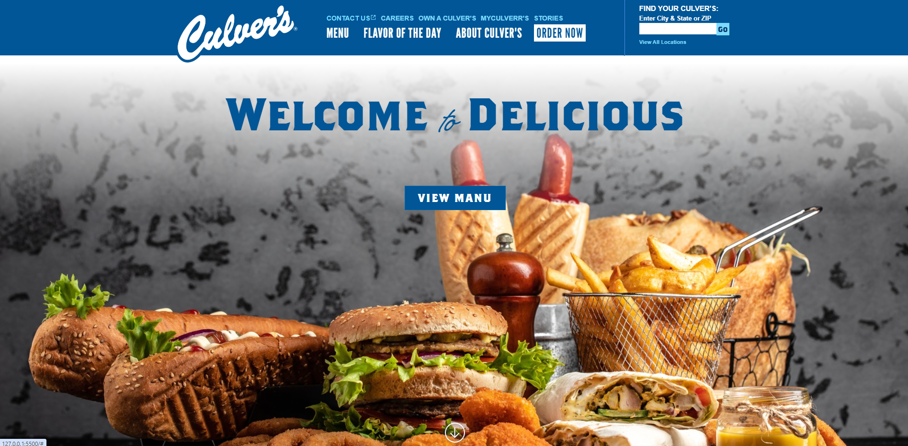

# Restaurant Project



## Table of Contents
- [Overview](#overview)
- [Features](#features)
- [Prerequisites](#prerequisites)
- [Installation](#installation)
- [Usage](#usage)
- [Screenshots](#screenshots)
- [Contributing](#contributing)
- [License](#license)

## Overview
This project is a restaurant website built with HTML, CSS, and JavaScript. It showcases a modern design with responsive features and interactive elements to enhance the user experience.

## Features
- Responsive design
- Interactive menu
- Online reservation form
- Contact form with validation

## Prerequisites
Before you begin, ensure you have met the following requirements:
- A modern web browser (e.g., Chrome, Firefox, Safari)
- A code editor (e.g., VS Code)
- Basic knowledge of HTML, CSS, and JavaScript

## Installation
1. Clone the repository:
   ```bash
   git clone https://github.com/Mahdirahimiam/restaurant-project-js.git

2. Navigate to the project directory:
   cd restaurant-project-js

## Usage
1. Open index.html in your web browser to view the project.
2. For development, open the project folder in your code editor and start customizing the code as needed.

## Contributing
Contributions are welcome! Follow these steps to contribute:

1. Fork the repository.
2. Create a new branch (git checkout -b feature-branch).
3. Make your changes and commit them (git commit -m 'Add some feature').
4. Push to the branch (git push origin feature-branch).
5. Create a new Pull Request.

## License

This project is licensed under the MIT License. See the LICENSE file for details.


Make sure to replace the placeholder paths for the images with the actual paths where your images are stored.

